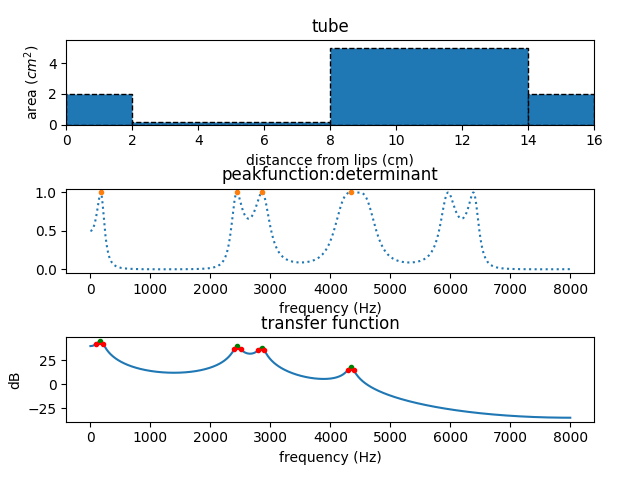

# Tuben
Tube model of vocal tract - resonance frequency estimation

## What is it?

This program will calculate the formant frequencies of a vocal tract and synthesize static vowels. The vocal tract area function is given by two lists specifying the *lengths* and *cross-sectional areas* of a number of straight tube segments, from lips to glottis. The areas can be read from table provided as a `.csv` file (`--table` and `--symbol` option), where the latter refers to the name of the column in the table to read from. 

Lengths and areas may also be given directly as comma-separated lists on the with the command line arguments (`--lengths` and `--areas`). Lengths may be a single value in which case it is interpreted as all segments being of this length. 

Lengths are in $cm$ and areas in $cm^2$.  

The file `Fant1971.csv` contains vowel cross sectional data from a Russian male speaker (Fant, 1971 - table 2.33-1, p 115).

The program can plot the area function and vocal tract transfer function, and synthesize a `.wav` file with a static vowel. 

The tube-to-formant calculation algorithms are from [Liljencrantz & Fant (1975)](#references). The two methods described (*determinant* and *phase*) should give identical or very similar results, both are included for completeness. 

## Usage
    
    python tuben.py [-h] [-l LENGTHS] [-a AREAS] [-t TABLE] [-s SYMBOL] [-m METHOD] [-n MAXNRFORMANTS] [-p] [-v] [-o OUTPUT] [--synt-f0 SYNT_F0] [--synt-dur SYNT_DUR] [-fs SAMPLERATE] [-c C]
    
## Examples

Using a table:

    python tuben.py --table Fant1971.csv --symbol a -o a.wav
    python tuben.py --table Fant1971.csv --symbol o -o o.wav
    python tuben.py --table Fant1971.csv --symbol i -o i.wav

Direct specification of lengths and areas:

`a-like`

    python tuben.py --lengths 2,6,6,2 --areas 2,5,0.2,2 -o aa.wav

`o-like`
    
    python tuben.py --lengths 2,6,6,2 --areas 0.1,5,1,2 -o oo.wav

`i-like` - with plotting

    python tuben.py --lengths 2,6,6,2 --areas 2,0.2,5,2 -o ii.wav --plot

## 3D Printing of Vocal Tubes

The `3Dprinting`directory contains code and instructions for 3D-printing of vocal tubes, for more information see Zhang et al, 2024.

## References

*Fant, G. (1971). Acoustic theory of speech production: with calculations based on X-ray studies of Russian articulations (No. 2). Walter de Gruyter.*

[*Liljencrants, J., & Fant, G. (1975). Computer program for VT-resonance frequency calculations. STL-QPSR, 16, 15-21.*](https://www.speech.kth.se/prod/publications/files/qpsr/1975/1975_16_4_015-020.pdf)

[*Zhang, K., Song, R., Tu, R., Edlund, J., Beskow, J., & Ekström, A. G. (2024). Modeling, synthesis and 3D printing of tube vocal tract models with a codeless graphical user interface. In Proceedings from FONETIK 2024 Stockholm, June 3–5, 2024 (pp. 155–160). Stockholm University.](https://doi.org/10.5281/zenodo.11396112) 